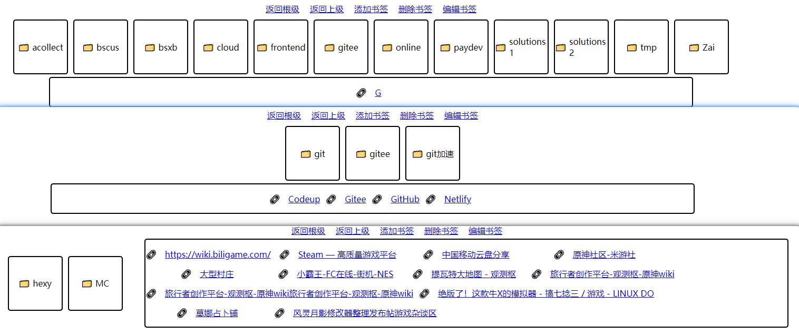
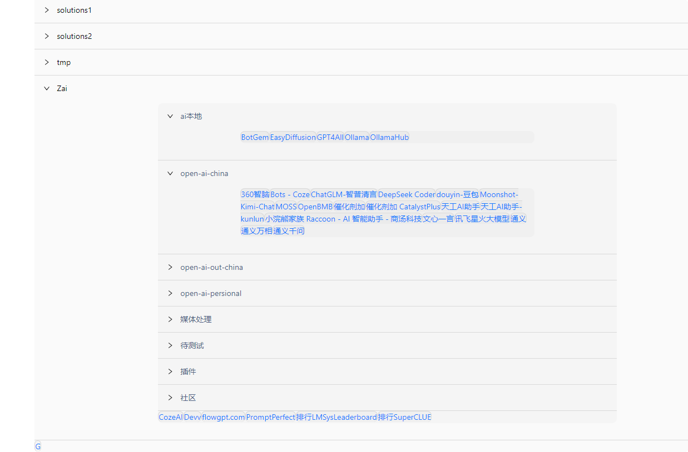

# 解析并渲染Chrome书签(Bookmarks)

##### 项目主干目录是 React TS ，但是我还不会React 😢

## demo中使用 html js css 渲染了书签 大概就是这个样子
### 直接打开(需要live-server) bookmarks-manage.html 就可以看到 大概的样子

# 后面会使用React实现一遍

# 还需要做一个更漂亮的UI和交互方式

## 目前是这个样子:

### 使用 React Antd 解析 : 

